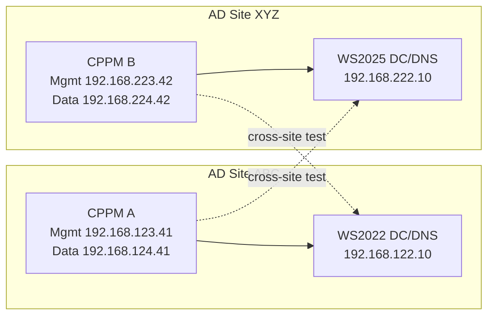

# ClearPass AD Site And `show domain` Offline Lab Runbook 2026

Contributors: bermekbukair, Codex
Last updated: 2026-04-03

## Goal

Build a lab that can answer one very specific question cleanly:

Why can a ClearPass node join Active Directory successfully, yet later show `show domain` as `offline`?

This runbook is focused on:
- ClearPass `6.11.x` / `6.12.x`
- Windows Server `2022` and `2025`
- `802.1X EAP-PEAP / MSCHAPv2`
- dual-NIC ClearPass behavior
- Active Directory site awareness
- DNS and route-selection differences between cluster nodes

## Short answer first

The warning you saw is not a vague ClearPass-only idea. It is tied to normal Microsoft Active Directory site logic.

In plain words:
- AD "site" here means an **Active Directory site**, not a generic network site label.
- The domain controller decides which AD site the client belongs to based on the **client IP subnet mapping** stored in AD Sites and Services.
- ClearPass is therefore not randomly guessing. It is learning site proximity through the same DC locator logic Windows clients use.

That means two important things for this lab:
- If both of your lab ClearPass nodes live on the **same IP subnets**, you are **not** truly simulating two AD sites, even if you point them at different DNS servers.
- If ClearPass has **two NICs**, Aruba says auxiliary traffic such as **Active Directory / LDAP** uses the **data interface by default** when the destination is not in either the management or data subnet, unless a static route overrides it.

That second point is a very strong candidate for why one node can behave differently from another.

## What official docs say

### Aruba

Aruba documents that during AD join:
- ClearPass warns if the selected domain controller is not the closest one.
- ClearPass can show a warning if it cannot identify the AD site the ClearPass server is located in.
- ClearPass offers a **Find Domain Controller** action to locate closer controllers.

Aruba also documents that for dual-NIC ClearPass:
- AD, LDAP, NTP, cluster traffic and other auxiliary traffic follow route-selection rules.
- If the destination is not in the management subnet and not in the data subnet, ClearPass uses the **data interface by default**.
- If it tries the data interface and fails, it does **not** retry management unless you define a host or subnet route.

### Microsoft

Microsoft documents that DC Locator works like this:
- the client discovers candidate DCs using DNS SRV records
- the client sends LDAP UDP discovery traffic to DCs
- the DC tells the client which AD site it belongs to, based on the **client IP subnet**
- if the chosen DC is not in the closest site, the client can do a site-specific lookup again

Microsoft also documents that:
- many AD ports are used in different scenarios
- **not every listed port is required in every scenario**
- blocking a few ports does **not** automatically prove the domain should show offline

## Why your colleague may not reproduce it

Your colleague's result does **not** actually disprove your case.

If his lab is flat, for example everything in one subnet, then:
- DC locator has a simpler life
- site selection may never become interesting
- route selection is simpler
- DNS answers may point to the same few DCs every time
- ClearPass may still show `online` even when some ports are blocked

So his test is still useful, but it mainly shows this:
- `show domain online` does **not** require every AD-related port to be open
- therefore blocked `139` and `464` alone are **not enough evidence** to explain your real issue

## Strongest current hypothesis

For your customer-like problem, the most likely causes are these, in order:

1. **AD site / subnet mapping mismatch**
- CPPM B sits on a subnet that AD maps to a different site than the chosen DC.

2. **Different DNS view per node**
- CPPM A and CPPM B ask different DNS servers.
- those DNS servers may return different SRV answers or different preferred DCs.

3. **Dual-NIC route-selection trap**
- CPPM B can resolve the DC, but for the actual connection it uses the data interface by default.
- if that path is filtered or asymmetric, the node may join initially or partly work, but later health checks can fail.

4. **A port block that matters for the health check path, but not the join path**
- join success does not guarantee steady-state health success.
- `show domain` may be using a different controller or a different sequence of operations later.

## Important conclusion before you build more

If you want to reproduce a **same-domain, different-site** problem correctly, you need **different client subnets** for the ClearPass nodes.

Just changing DNS is not enough.

Why:
- Microsoft site selection is based on the client IP subnet known to AD.
- If both CPPM nodes are still on the same subnets, AD sees them as the same site from a DC locator perspective.

## Recommended lab design

### Use Windows Server 2022 first

Use `Windows Server 2022` as the primary baseline.

Why:
- simpler baseline
- fewer moving parts
- less chance of mixing a real ClearPass issue with a Windows Server 2025 DC Locator behavior change

### Use Windows Server 2025 second

Use `Windows Server 2025` only as a comparison phase.

Why:
- Microsoft says Windows Server 2025 blocks NetBIOS-style DC location by default through `BlockNetBIOSDiscovery`
- ClearPass should still be using DNS-style discovery when you provide FQDNs correctly
- but 2025 still adds another variable you do not need on day one

So the clean order is:
1. prove behavior on 2022
2. repeat on 2025
3. compare

## Proposed topology

Use a two-site AD lab, not a one-site flat lab.



## Why this topology is better than the current flat lab

It lets you test four things separately:
- same-site join
- cross-site join warning
- `show domain` after same-site join
- `show domain` after DNS, route, or firewall manipulation

It also avoids the biggest false result:
- "different DNS servers" without different client subnets

## AD site/subnet plan

Recommended AD Sites and Services mapping:

- site `ABC`
  - subnet `192.168.122.0/24`
  - subnet `192.168.123.0/24`
  - subnet `192.168.124.0/24`

- site `XYZ`
  - subnet `192.168.222.0/24`
  - subnet `192.168.223.0/24`
  - subnet `192.168.224.0/24`

This is intentionally explicit.

If you keep both ClearPass nodes in `192.168.123.0/24` and `192.168.124.0/24`, AD will not naturally view them as separate sites.

## Domain and naming suggestion

Use one forest and one domain first:
- AD DNS name: `corp.lab.example`
- NetBIOS: `CORP`

Use one writable DC per site first:
- `abc-dc01.corp.lab.example` on Windows Server 2022
- `xyz-dc01.corp.lab.example` on Windows Server 2025 or 2022

Optional later:
- add an RODC in the branch site
- only after the writable-DC baseline is proven

## ClearPass-specific guidance for PEAP-MSCHAPv2

For `EAP-PEAP / MSCHAPv2`:
- ClearPass must join the domain
- password server selection matters
- if you later add an RODC, treat that as a separate test phase, not the starting point

The Philipp Koch blog is directionally useful here:
- join can be done against a writable DC
- password servers can then be steered for branch behavior
- RODC adds its own SAM / password replication complications

So for this case, do **not** start with RODC.
Start with writable DCs only.

## Test phases

### Phase 1: Baseline same-site, all normal

Goal:
- prove the lab can work cleanly before you break it

Build:
- CPPM A in site `ABC`
- DC in site `ABC`
- DNS on CPPM A points to the local DC/DNS

Expected:
- join succeeds
- no co-location warning if the DC is actually local to the client subnet mapping
- `show domain` = `online`
- PEAP-MSCHAPv2 test succeeds

### Phase 2: Cross-site join warning

Goal:
- reproduce the warning on demand

Build:
- keep CPPM B in site `XYZ`
- manually try to join it against the `ABC` DC

Expected:
- ClearPass warns that selected DC is not co-located / not closest
- `Find Domain Controller` should prefer the `XYZ` DC if AD sites/subnets are correct

### Phase 3: Different DNS, same routing

Goal:
- separate DNS effects from site effects

Build:
- keep CPPM B in `XYZ`
- point its DNS to a resolver that prefers or exposes the `ABC` DC first

Expected:
- SRV answers differ from CPPM A
- chosen DC may differ
- join may still succeed
- `show domain` may change depending on the DC that gets cached and whether that path stays reachable

### Phase 4: Dual-NIC route-selection trap

Goal:
- test Aruba's documented auxiliary-traffic route behavior

Build:
- keep CPPM dual-NIC
- put the DC or DNS outside both the management and data subnets of that node
- do **not** add a static route first

Expected:
- ClearPass uses the data interface by default for AD traffic
- if the data path is filtered or asymmetric, `show domain` may go `offline`
- after adding the correct static host/subnet route, `show domain` should recover

This phase is one of the best matches for your real customer story.

### Phase 5: Selective port blocking

Goal:
- prove which ports matter for **join**, **steady-state domain status**, and **PEAP auth**

Do not begin with random full blocks.
Use a controlled matrix.

Recommended order:
- block `139`
- block `464`
- block `445`
- block `135`
- block `389`
- block `53`
- block `88`

Expected practical reading:
- `139` alone may not change much
- `464` alone may not change much
- `53`, `389`, `88`, or `135` are far more likely to affect real behavior
- `445` can matter depending on the exact join/auth path

## What `show domain` does and does not prove

Aruba documents `show domain` only as a way to display AD domain controller information and status.

So treat it carefully:
- `online` does **not** prove every PEAP dependency is healthy
- `offline` does **not** prove the original join was wrong
- it is one health signal, not the whole story

The right correlation set is:
- `show domain`
- `ad auth`
- PEAP test outcome
- DNS SRV answers
- route path/interface used
- packet capture or firewall counters

## Minimum evidence set to capture for every test case

### On ClearPass

Run and save:

```text
show domain
network nslookup -q SRV _ldap._tcp.dc._msdcs.corp.lab.example
network nslookup -q SRV _kerberos._tcp.dc._msdcs.corp.lab.example
ad auth -u <testuser> -n CORP
network ip list
```

If the site-specific SRV query works on your version, also capture:

```text
network nslookup -q SRV _ldap._tcp.ABC._sites.dc._msdcs.corp.lab.example
network nslookup -q SRV _ldap._tcp.XYZ._sites.dc._msdcs.corp.lab.example
```

### On Windows DC

Run and save:

```powershell
nltest /dsgetsite
nltest /dsgetdc:corp.lab.example
Resolve-DnsName -Type SRV _ldap._tcp.dc._msdcs.corp.lab.example
Resolve-DnsName -Type SRV _kerberos._tcp.dc._msdcs.corp.lab.example
Resolve-DnsName -Type SRV _ldap._tcp.ABC._sites.dc._msdcs.corp.lab.example
Resolve-DnsName -Type SRV _ldap._tcp.XYZ._sites.dc._msdcs.corp.lab.example
```

Also record in AD Sites and Services:
- site names
- subnet objects
- which subnet is mapped to which site

## How to read the famous warning correctly

When ClearPass says it and the selected DC do not belong to the same AD site, it is basically telling you:
- "I asked AD where **my** client subnet belongs"
- "the DC told me I appear to belong to a different AD site"
- "the DC you selected is not the closest one for that site mapping"

So the warning is really about:
- AD subnet-to-site mapping
- DC locator
- which DC DNS and LDAP discovery returned

It is **not** only about generic Layer 3 distance.

## Why CPPM B can be broken while CPPM A is fine

This is very plausible if:
- both nodes have different DNS servers
- one node receives different SRV answers
- one node has a different static route set
- one node's dual-NIC data path is wrong
- one node's management/data subnet falls into a different AD site mapping

So the fact that CPPM A is healthy does **not** prove CPPM B should also be healthy.

## Clean recommendation for your lab build

Do this in order:

1. Keep `cppm611` as site `ABC` baseline.
2. Build one Windows Server 2022 DC/DNS for `ABC`.
3. Build one second DC for `XYZ`.
4. Move `cppm612` to **different client subnets** if you really want to test different AD sites.
5. Join each ClearPass node to its local writable DC first.
6. Confirm `show domain` is `online` in the healthy same-site case.
7. Only then introduce:
- different DNS
- blocked ports
- cross-site DC selection
- missing static routes
- optional RODC

## Most likely outcome of this lab

The lab will probably show that:
- blocked `139` and `464` alone are not the real root cause
- the more realistic root cause is either **AD site selection**, **DNS SRV answer differences**, or **dual-NIC route selection**
- in a cluster, node-specific DNS and node-specific routing are enough to make one node show `offline` while another stays `online`

## Practical next step in this repo

Use the existing Windows template guide first:
- [WINDOWS_AD_TEMPLATE_VM_GUIDE_2026.md](./WINDOWS_AD_TEMPLATE_VM_GUIDE_2026.md)

Then treat this runbook as the investigation plan for the AD/DC side.

## Sources

Official Aruba and Microsoft references used for this runbook:
- Aruba: Joining a ClearPass Server to an Active Directory Domain
  - https://arubanetworking.hpe.com/techdocs/ClearPass/6.11/PolicyManager/Content/Deploy/Active%20Directory/Joining_AD_domain.htm
- Aruba: ClearPass CLI Guide PDF (`show domain` command reference)
  - https://arubanetworking.hpe.com/techdocs/ClearPass/ClearPass_CLI_Guide.pdf
- Aruba: ClearPass Service Routing
  - https://arubanetworking.hpe.com/techdocs/NAC/clearpass/platform/service-routing/
- Microsoft: Locating domain controllers in Windows and Windows Server
  - https://learn.microsoft.com/en-us/windows-server/identity/ad-ds/manage/dc-locator
- Microsoft: Locating Active Directory Domain Controllers in Windows and Windows Server
  - https://learn.microsoft.com/en-us/windows-server/identity/ad-ds/manage/dc-locator-changes
- Microsoft: How to configure a firewall for Active Directory domains and trusts
  - https://learn.microsoft.com/en-us/troubleshoot/windows-server/active-directory/config-firewall-for-ad-domains-and-trusts
- Secondary field reference: Philipp Koch blog on ClearPass + RODC + PEAP-MSCHAPv2
  - https://blog.philipp-koch.net/2021/11/clearpass-read-only-domain-controller.html
